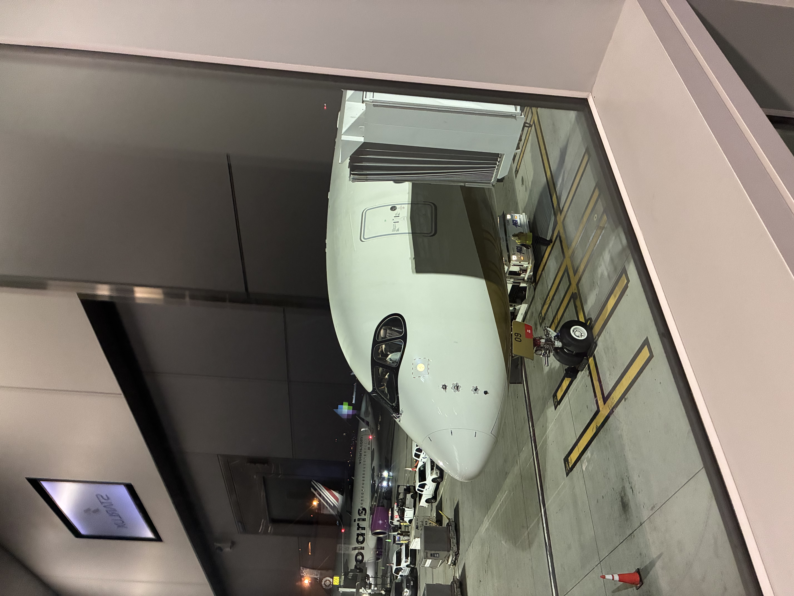

Here's our plane. I have to have an aisle seat unless I'm giving it up for Thomas, who needs it more. I secured seats 41B and 41C early on — there's no row behind us. We lucked out that no one purchased the window seat, so we got the row to ourselves. Then the row in front of us only had one passenger.

