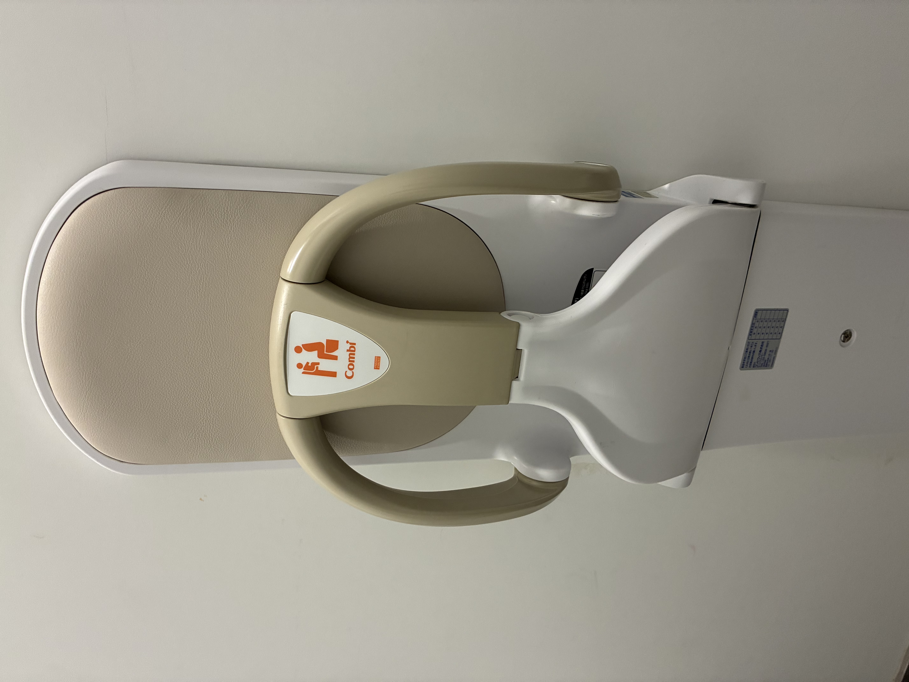
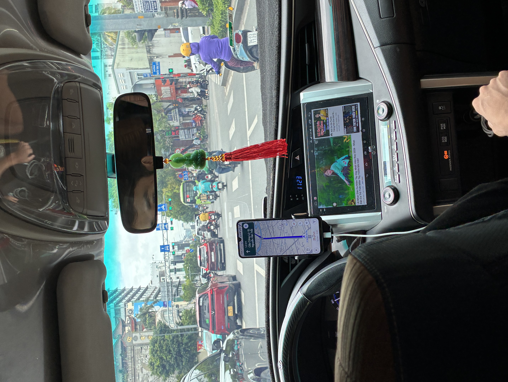
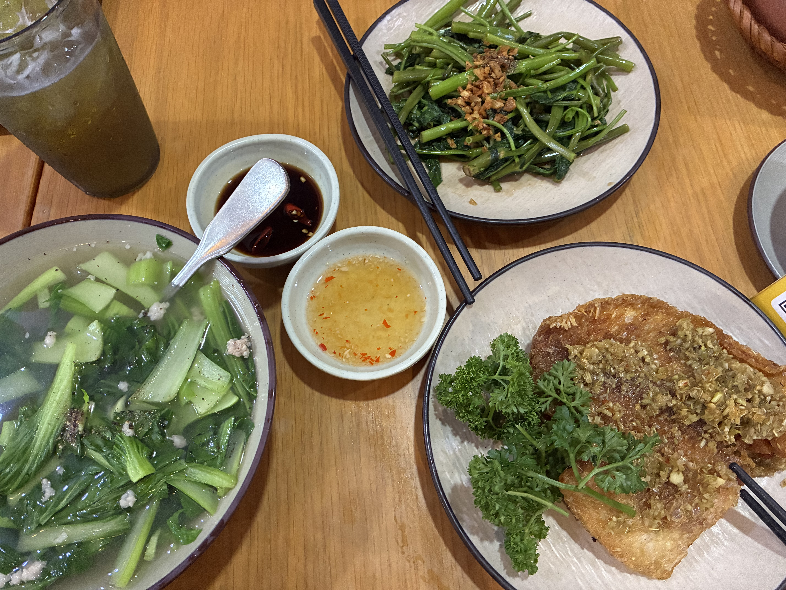

We're at the gate in Taipei waiting for the next flight to Ho Chi Minh City. The flight here was actually not too bad. Six hours went by quicker than I'd thought — I could survive another six. Gabe asked at the house if I was excited. Told him it'll be close to 24 hours before we touch down in Vietnam, so my excitement won't kick in until Saigon comes into view from my flight window.

Thomas survived the long flight, popped some pills — maybe one or two more than prescribed for the occasion. Now that this is the fourth trip, he's much more relaxed. Not worried and whiny and frustrated if he has to wait for someone to come push his wheelchair.
What I appreciate most about these airports in Asia, whether it's here in Taipei, Tokyo, or Seoul, is that everything is clean. Kiosks and bathrooms are more efficient. There are cushioned benches you can stretch out on horizontally, something I don't see in the States — almost as if it's intentional, to deter.

In the restroom stall, there's a seat to secure your young child while you do your thing.

Honestly didn't care for the 2 meals we had on the plane. Not that I ever had any expectations for airline food. As I walked toward the women's restroom, I saw a noodles and dumplings place. I ordered meal #2 — spicy beef noodle and wonton dumplings and a boba drink — for a little over $15. Already appreciating the lower cost of Asia, especially at an airport. (A small bottle of water at LAX or Burbank is already $8. Like why?) Anyway, I normally love wontons, but these had a strong perfume smell; I had to take another bite to assess. Really odd to get that strong a fragrance off food. Must've been the chili oil they were sitting in. The noodles hit the spot, though.

I arranged and prepaid for this car ride from airport to hotel — costs more than if we'd ordered a Grab from here, but it's peace of mind. A little bit of traffic, about 30 minutes to the hotel.

I'm learning to ask the hotel people for food recommendations. She asked if I just wanted Vietnamese rice dishes. Yes, please. The place was just a few blocks away and all three dishes were yummy. Thomas chose the fried red snapper with lemongrass and it was so good. Fancy that the coconut is stamped with the restaurant's name. We'll definitely be back and order another set of 3 new dishes, since the menu has lots of options.

