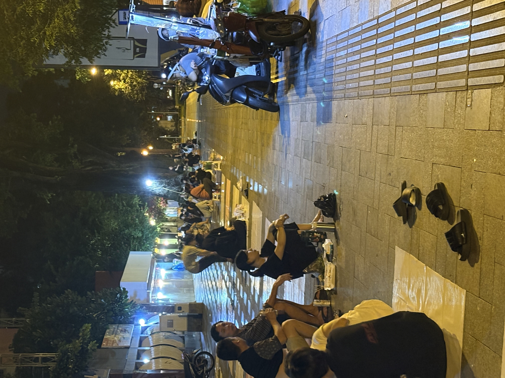
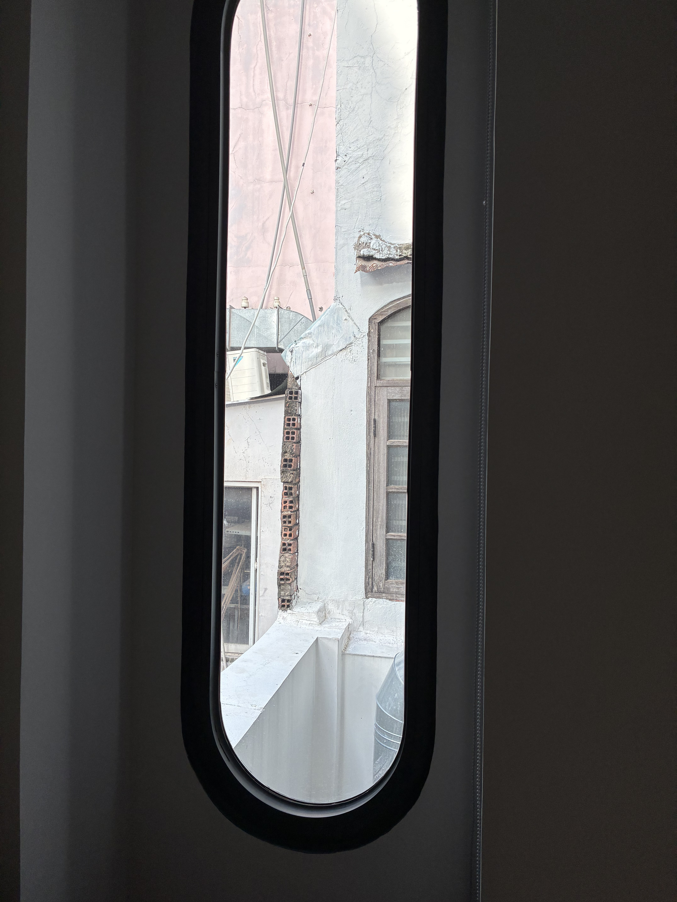
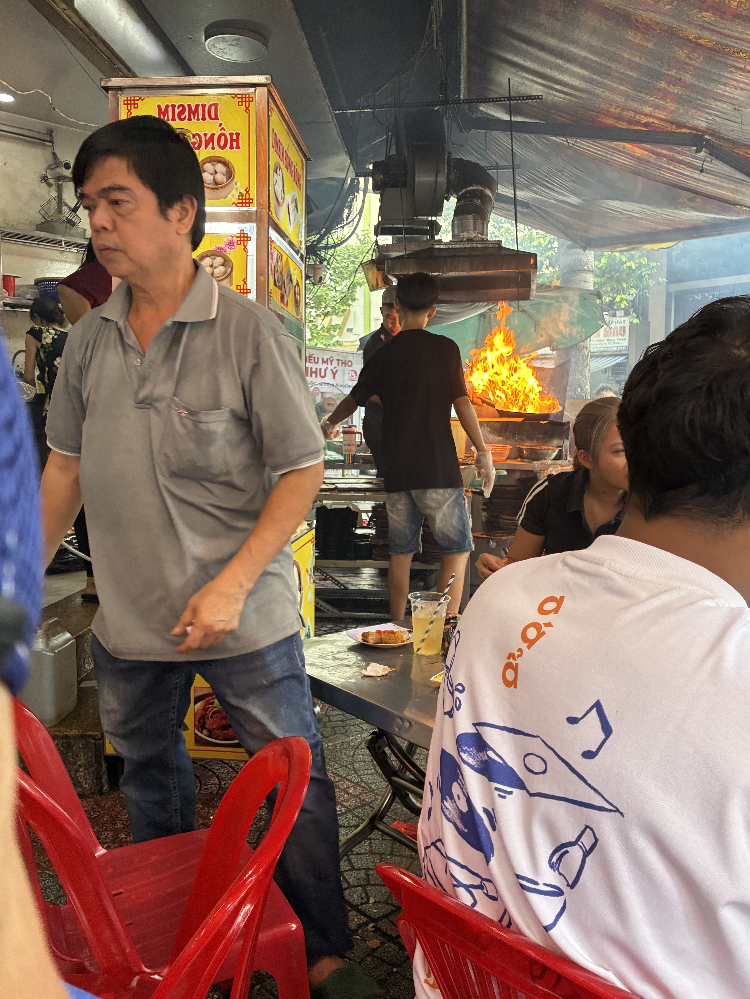
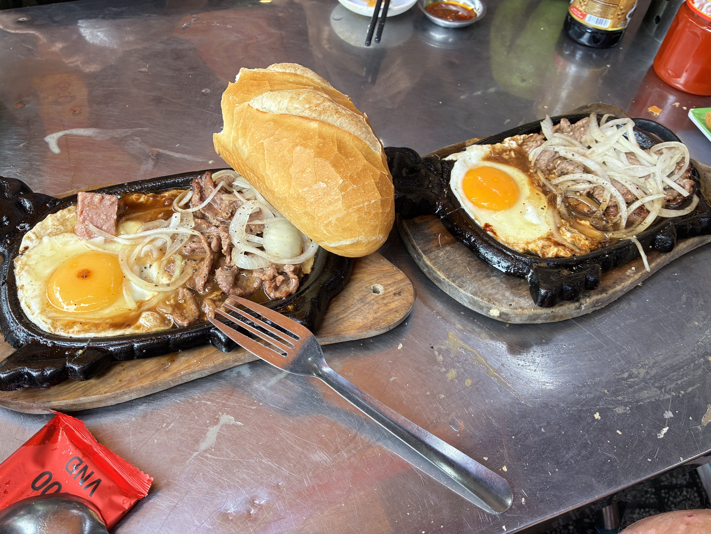
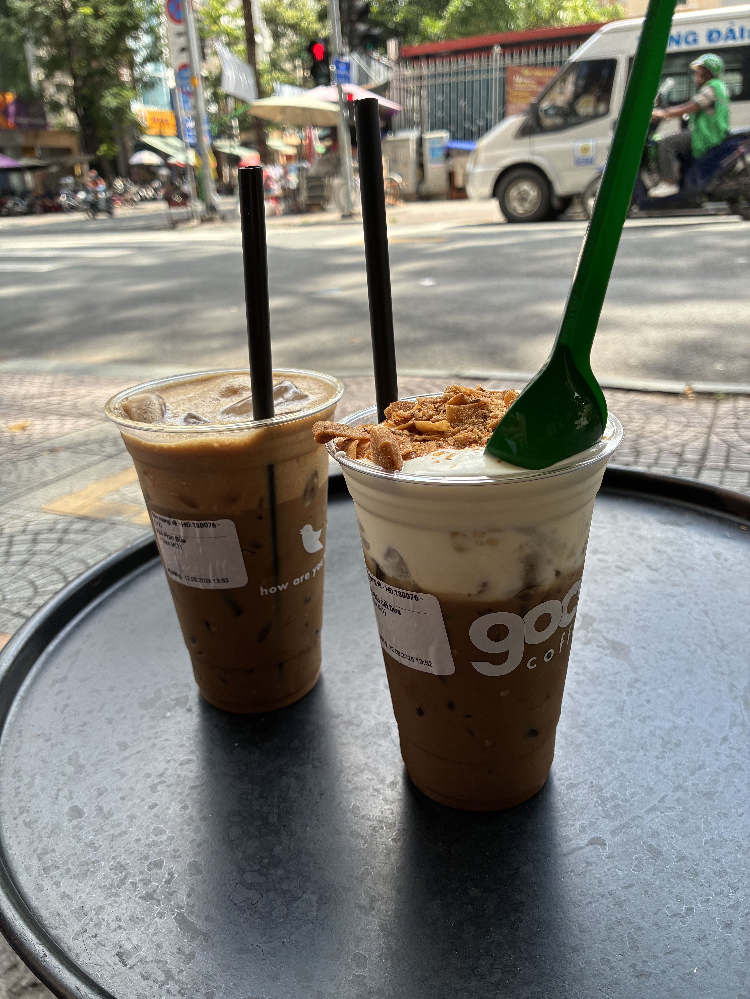
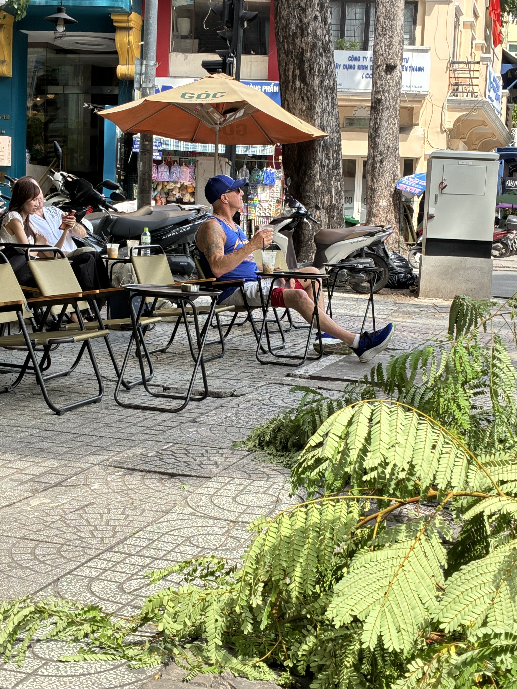
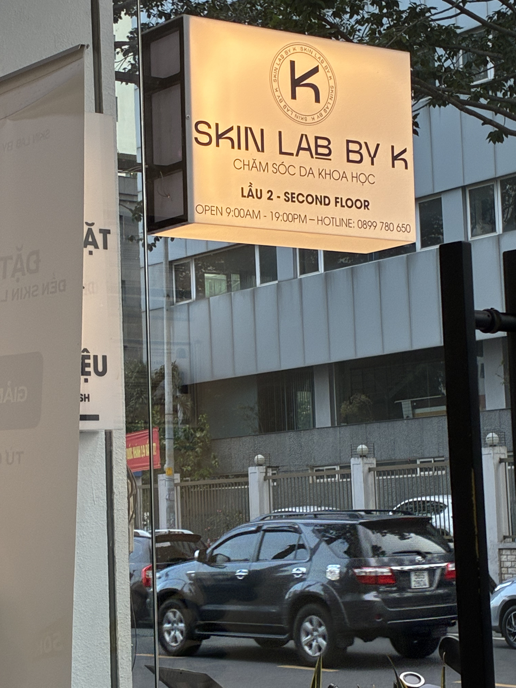

We headed back to IconSphere Hotel to take a much-needed nap, and it went as we both expected. We slept for at least six hours, waking up past 9 PM. The bed is perfect, including the pillows. The room is small, like the narrow hotel itself, but it's newer and very comfortable. Shower head pressure is strong. I think this is the first true bidet hotel in Vietnam for us.

At 11:30 PM, we took Grab motorbikes to Ben Nghe Street Food. Most of the stalls apparently closed at 11:00 PM; the 12:30 AM closing is for you to hang out. There was only the Thai food stall — I ordered a vegan pad Thai, Thomas had stir-fried morning glory and the mango rice dessert. We had 2 Saigon beers also. All good for less than 350,000 VND.

We walked around a little after and saw small groups of young people sitting and chatting away. A few carts served drinks and grilled skewers, including dried squid, which I miss. This is why many describe Vietnam with one word, "alive," because it's past midnight and folks are still about and it's safe to do so.

That 6-hour nap ruined it for me last night. Couldn't sleep at all, but that's okay, I'm on vacation! I'm so happy with this hotel. It has the largest TV also, with Netflix and Prime and whatever else. What cracks me up is the window, though — we were told at check-in that our room has only a small window that doesn't open. Fine, I guess. The room is $86 a night, so I wasn't expecting a panoramic view of anything.

Thomas suddenly found himself right in front of this Bo Ne restaurant after getting his haircut. He'd seen it on Instagram, how popular it is, always a line. So, we got two seats to check it out. Hmmm... no, another hyped up place that was really okay at best. Last year, we found a great little place within walking distance from our hotel (Beef Steak - Mrs. Huyen Thanh Quan), and it was so great, we went there both mornings. The lady shared her recipe with me as I told her how much Thomas loves it.

Coconut coffee is my favorite. This place had newer and nicer little seats than the tiny stools you normally see.

Squeezed in two beauty appointments today, a wax and a facial. The facial was something else. I went to the one that I saw on Instagram, so I kinda knew what to expect. The "doctor" did a skin imaging analysis and showed me what I already knew, only much worse. She then said a lot of things. I waited until she was done to tell her that I didn't understand most of what she said [in Vietnamese], but I can tell from the images that my skin is no good. My mother reminds me of this every time I see her. She recommended some "enzyme" therapy that cost over three million VND. I asked out loud how much that was in USD and thought this damn treatment better be good, even though I know some things are irreversible.

