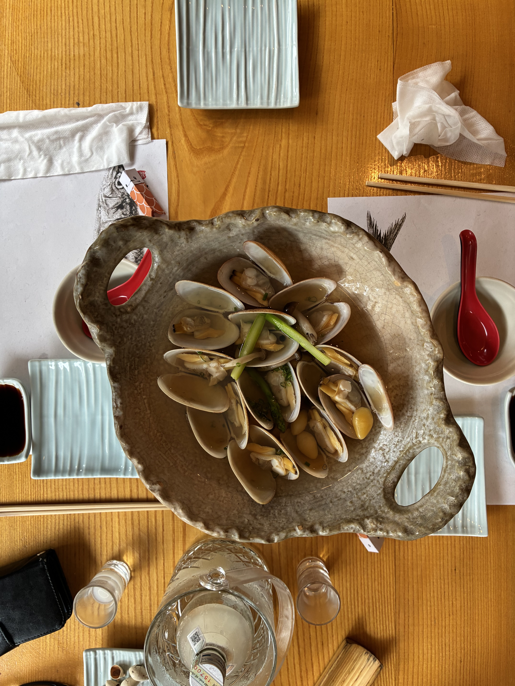
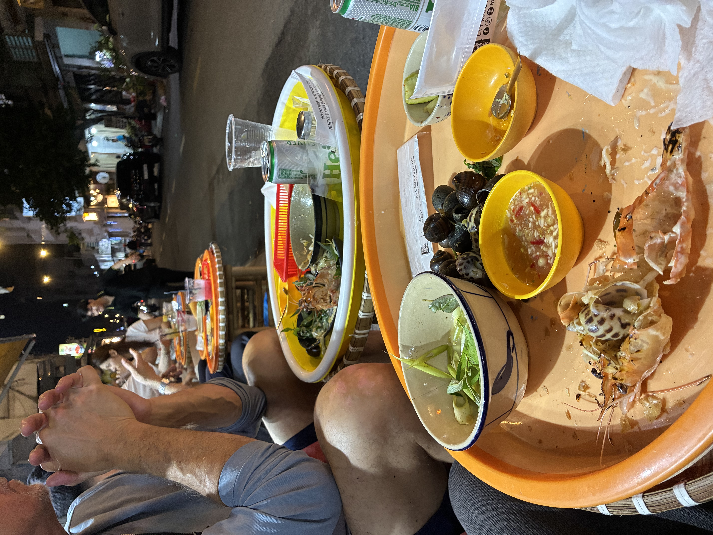

I love riding on the back of the scooter in Vietnam. Grab rides are cheap and fun. And by fun, I also mean it's terrifying. It's the most daring thing I've done in my entire life. With every ride, you're inches, more like centimeters, from going down. It can't be explained — you can watch a video clip of the complete madness of traffic here, cars and motorbikes and bicycles and pedestrians weaving through, but to be in the middle of it, with a little bike helmet that does fuck all, nothing really, is putting my complete trust for my life in the steering of someone who grew up as a baby riding on a scooter with three other siblings. The bike is an extension of their daily existence. They ride it like they walk, it's going to be in motion and they'll get around everyone and everything. I do understand Thomas's growing dread of it, as he had a near-death car accident 30-plus years ago that has affected him since.

We had [sushi](https://sushihokkaidosachi.com.vn/en/) for lunch today. The sake is always the most expensive, meaning it's comparable to what it costs in the States. The bill came up to $58, so half of what it would cost. We do not add a tip here at restaurants. I don't want to turn Vietnam into that. But we always tip drivers and other service providers. I'm sick of transactions that happen at counters in the United States asking for a tip. When did this sneak in and become the norm? You literally just handed me a bagged sandwich or a coffee at the counter.

My absolute favorite thing to eat in Vietnam is ốc. We went to [Ốc Béo Hà Nội](https://www.foody.vn/ho-chi-minh/oc-beo-ha-noi), and it did not disappoint. Thomas arrived first on the bike and secured premium front-row stools. I asked for the two most popular dishes since I was overwhelmed by the menu, and ordering one of everything felt like the kind of gluttony that's frowned upon. One type of snail came out in lemongrass broth, and the other, more elongated and chewier, came in a sweet coconut broth with fresh coconut shavings. That's why we had baguettes, to dip in this amazing broth. We then ordered two grilled [river?] prawns. He showed me pictures of the two ways they prepped the prawns and said the difference was that one was richer. Well, why the hell wouldn't I want the richer kind. Turned out he meant cheese was added on top. I had to scrape all of it off, since whoever thought fresh seafood needed cheese should be committed. It tasted like lobster, so good. I still liked the snail stall we had in Hà Nội two years ago better. All the snails were right there, we just pointed to the ones we wanted. She then steamed them right there in the best broth possible: full of lemongrass and fresh pineapples.

