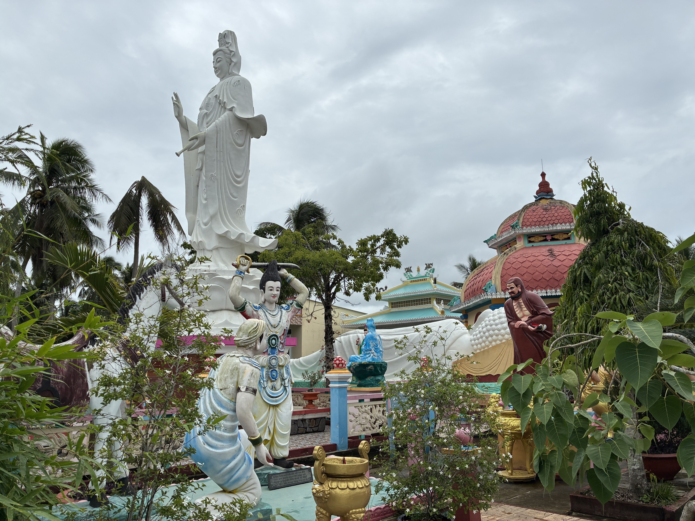
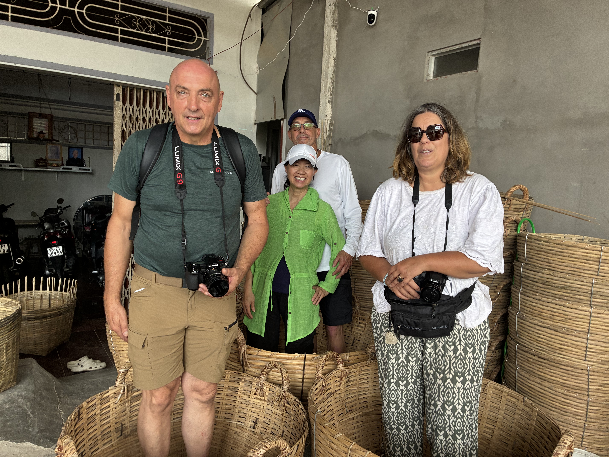
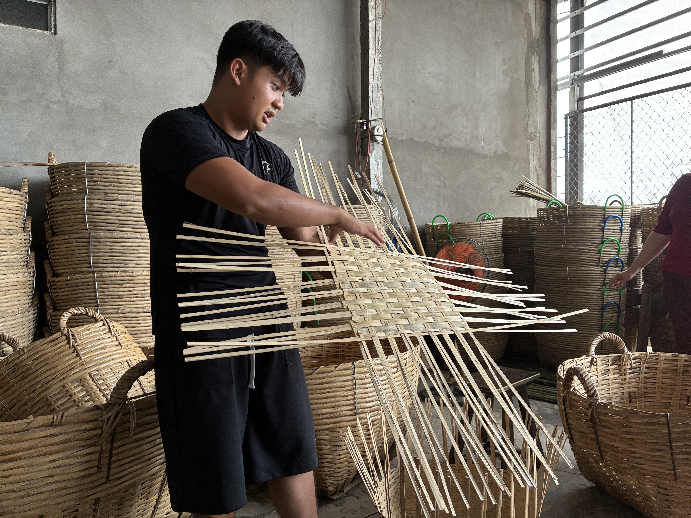
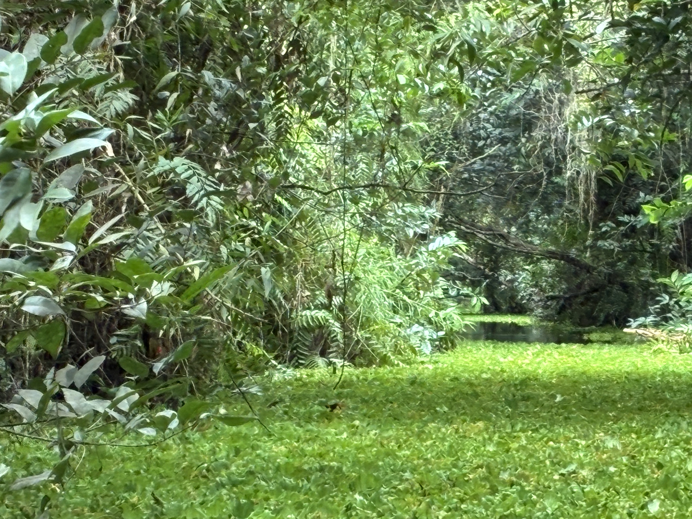
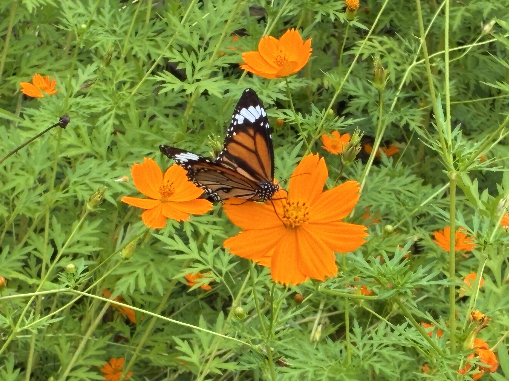
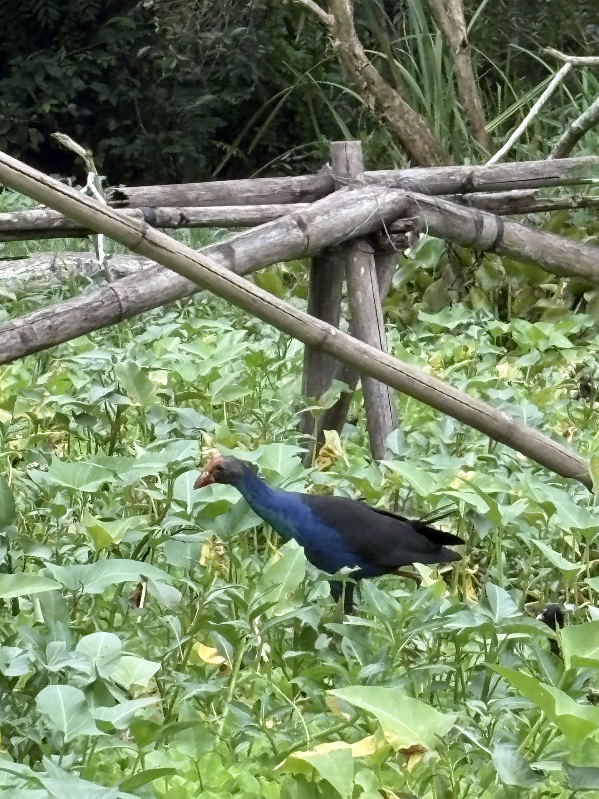
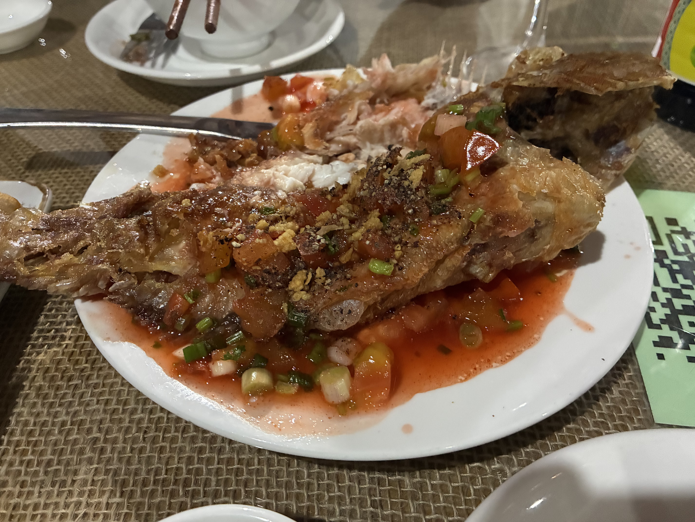
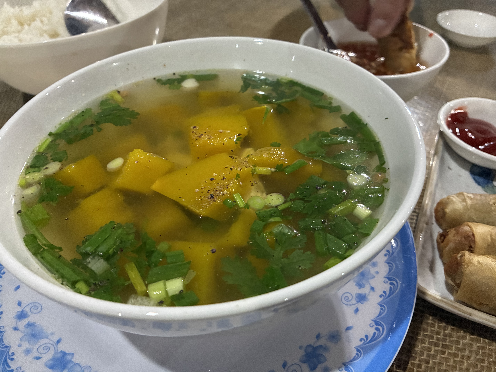

I had 2 eggs sunny side up with iced Vietnamese coffee. Chloe smiled when I asked for a baguette. Vietnamese people smile when they mean no. Sliced white bread is all there is at this remote place. Thomas wants to get back into intermittent fasting. I looked up the translation for this to show Chloe so she wouldn't think he was picky about breakfast when he didn't want to order anything. She read the translation off my phone and wondered if it was for religious reasons. I said no, it was his way of trying to get healthy. She nodded and said she understood. What I really wanted to tell her was how dumb Thomas is. You come to Vietnam, home to some of the best cuisine on the planet, and decide to practice fasting? Sheesh.

It's been raining steadily. Started last night. The sound of rain is exactly what this day calls for. If anything, I wish it'd rain harder. We're in the hammocks on the back porch, right over the river. Massive [basa catfish](https://www.google.com/search?q=basa+cat+fish&rlz=1C5FPAB_en&oq=basa+cat+fish&gs_lcrp=EgZjaHJvbWUyBggAEEUYOTIGCAEQRRhA0gEIMjUzNGowajeoAgiwAgHxBVFXL-deiulO&sourceid=chrome&source=chrome.ob&ie=UTF-8&safe=active&ssui=on), native to the Mekong Delta, surface now and then. Coconut, banana, jackfruit, and papaya trees surround the property. A giant grapefruit tree with fruits hanging just above the water. A beautiful wren flew in and perched on a coconut frond. Paradise can be just like this. With perfect WiFi.

I took a short walk around the area because Chloe came by to say that the massage lady wanted to reschedule at the last minute. I told Chloe to tell her no, let's just cancel. Weird to reschedule a 10:00 appointment right at 10:00. Worse, the lady said it was due to the rain, which has been happening for the last 12 hours. That's what you get staying in a bungalow, nothing is formal and the vibe is whatever. There are quite a few garbage bags and garbage strewn about along the sides of the road. That makes me sad. I plan to ask somebody why. Isn't there garbage service? Clearly they must realize this is not sustainable. Maybe garbage day is monthly instead of weekly? This beautiful place does not need to be tainted like this.

Every home here seems to raise chickens, not that I can tell which ones belong to which home, as they just roam about. I miss my seven that I had to rehome 2 years ago. The chickens here are scrawny in comparison. Well, they free range all day. The roosters are definitely much better looking with grand plumage. My eggs this morning were fresh because the yolks were bright orange and tasted good. A man on his bicycle was selling something I couldn't quite make out from his pre-recorded hawking, blasted on loop from a speaker mounted on his bike. Turns out he had a 2-level cage (2x2x1 foot) strapped to the back of his bike with live chickens inside. I could never in a million years eat a chicken I'd personally raised and given a name. One of the chickens I had, Lulu, died. She just keeled over one day, but she had problems (an eye infection) from the get-go. Thomas had to take her out to the fields near the big lake. My poor Lulu.

We did the tour with another couple from France. They spoke some English to save us as we do not speak French. Our guide Johnny was a young man whose English surprised me as it was very good and had a hint of British accent. He learned it all from watching Disney movies. First stop was the Pagoda. A couple of giant statues and lots of smaller, very colorful statues of Buddhas and bodhisattvas. Next stop was seeing how bamboo baskets are made. I'm so impressed that from start to finish is all handmade. We were shown the 5-stage process, and the finished product is the sturdiest basket money can buy. From lighter ones for carrying flowers to the market to heavier ones to carry charcoal and whatever else. The largest one they make can hold 300 kg, takes 1 person two full days to make, 4 people to carry, and sells for 1 million VND (40 USD). While we went to one specific man's shop (and home), many of his neighbors also make similar baskets. And I find this true throughout Vietnam: shops within a particular neighborhood sell identical or similar items. The last stop was the highlight, a boat ride through the mangrove forest. First time I was in a real jungle, and it was so lush and abundant.

I devoured tonight's dinner as I'd skipped lunch to go on the tour. We had egg rolls, grilled tilapia, and pumpkin soup; the kind of meal I could eat every day. Thomas complimented the lady who cooked the dishes. She then brought out sliced watermelons and papayas. She pointed to the field just outside the front gate where the papayas came from. They are the sweetest I've ever had.

