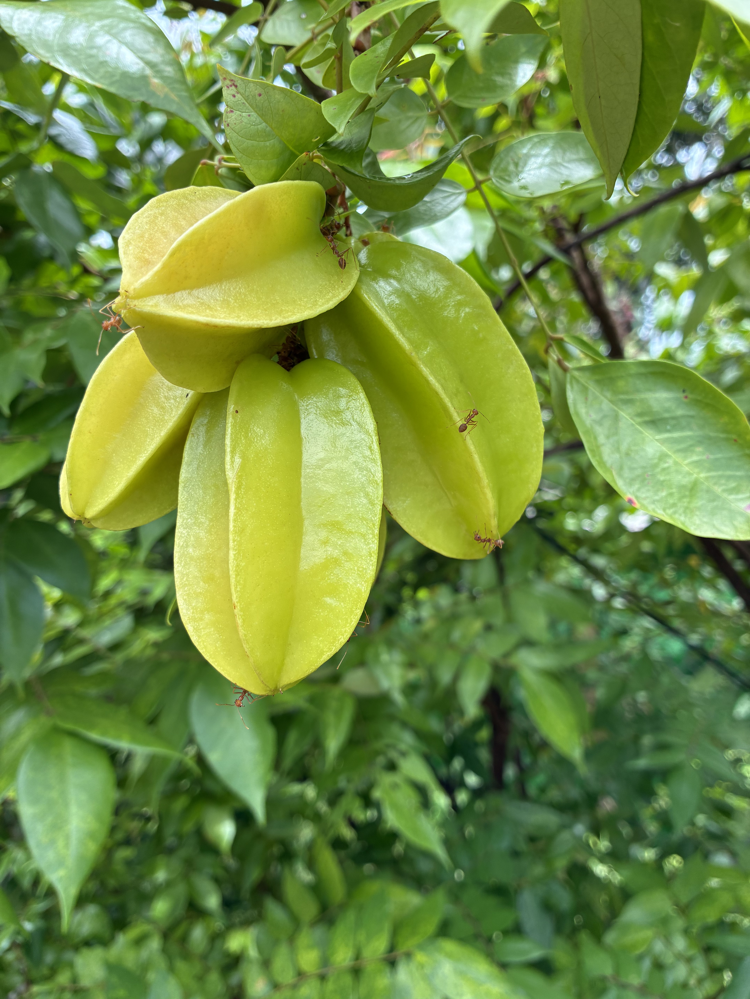
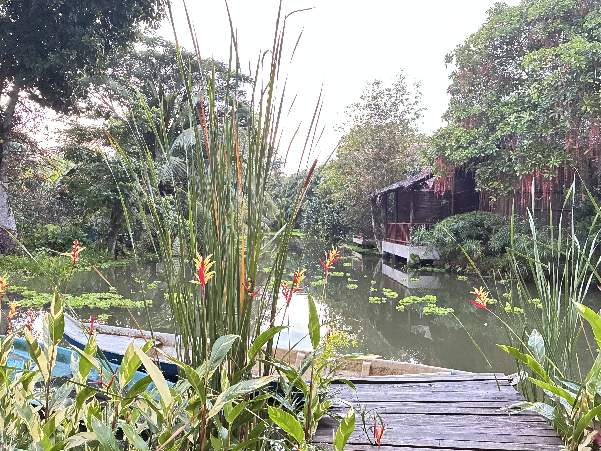

Thomas turns 60 today. He wants to celebrate in both time zones. He can celebrate it all year long for all I care. Our last day at Green Village and we plan to just chill here. The French couple already did the floating market tour and when asked if they'd recommend it, they said, "fifty-fifty." That's the most unhelpful answer ever. I take that as a no and believe they were trying to be polite since our guide and driver are locals here. Then, the husband whispered, "pollution." I did ask Johnny yesterday about the trash around the roadside. He said there is trash pickup but not consistent in smaller neighborhoods whose residents still live in poverty. He said the people will also burn their own trash.

The disadvantage to this place is no access to any real restaurants. We eat whatever this place has: breakfast and lunch menus are limited. Dinner was great yesterday and it's predetermined by the cook. You'd only want to come here if you want to do absolutely nothing but lie in your hammock on the back porch. There's no TV in the room. In the evenings, there's karaoke coming from a nearby residence. Thomas might join them tonight.

I'm grateful for the 90-minute massage this morning. She came to the room, used her phone to put on some spa-like music. I didn't expect the hot stone treatment also. With tip, it was just over $15.

