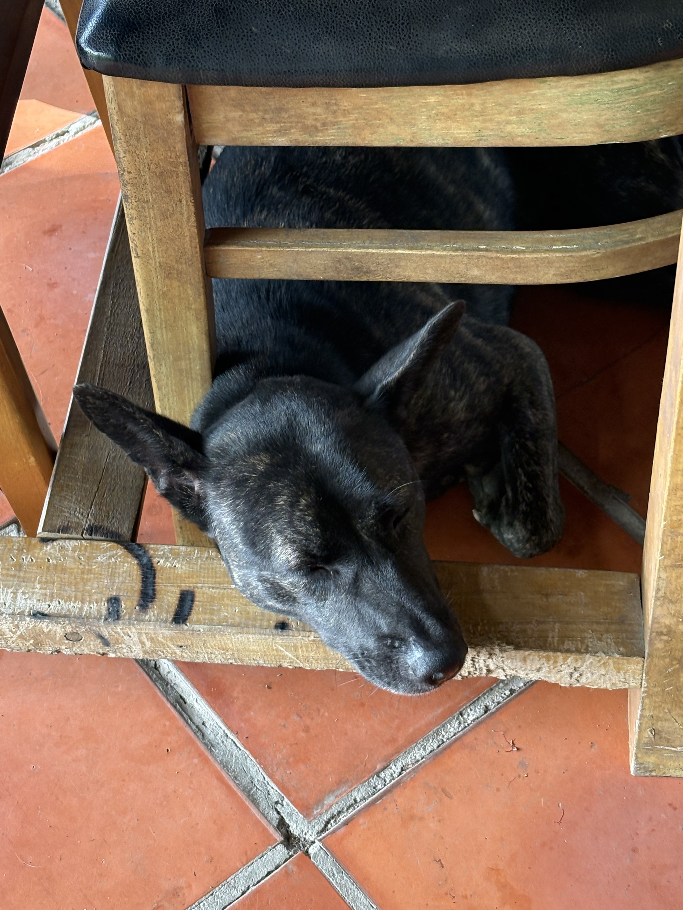

Growing up, I loved going to see my Dad's nephew, who has a wife and a young kid. The reason is because they live in "miền quê" - Vietnamese for farmland, countryside. This hotel in Cần Thơ reminds me of that. It's green and peaceful. I bet everyone knows everyone here. We walked around the neighborhood and saw some beautiful homes with marble driveways and iron gates. Some even have family burial plots, massive marble ones, not just a sign of respect but also of wealth, I think.

I do miss access to all the foods, though. A big part of why I come to Vietnam is for the food, and not having that makes the three-night stay just enough. There are two dogs and a cat in residence, and I almost envy their stress-free life. Happy that they, and all animals, get to live in this slice of heaven. When I mentioned this, Chloe assured me that Coffee, the dog, works hard at night watching over this place.

