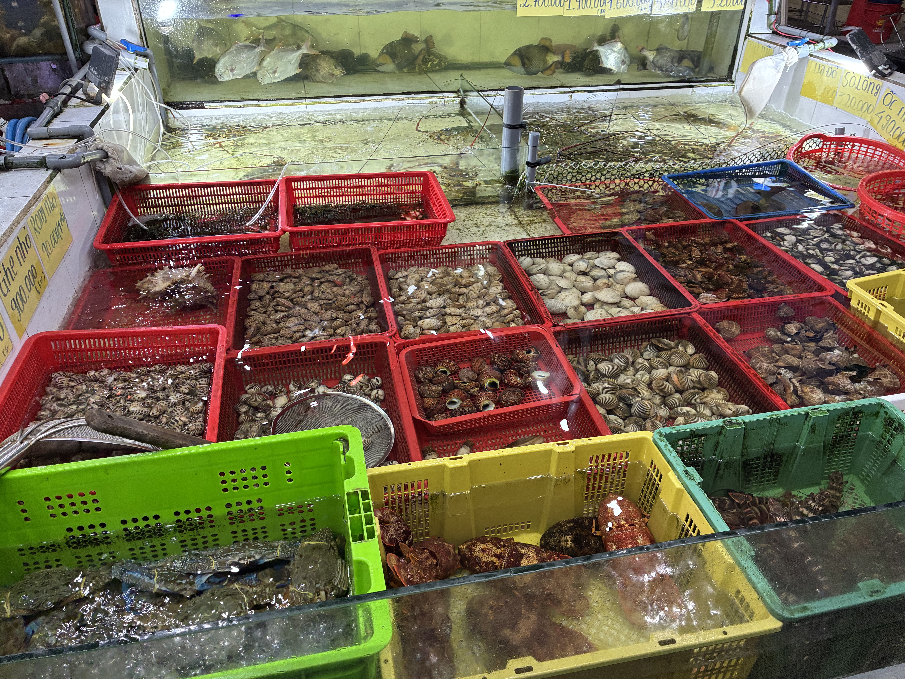

Last night we turned right instead of left outside the alleyway and found another seafood restaurant where we had one of the best dinners of the trip. Every Vietnamese dish we ordered was exactly as we'd hoped, and some were even better.

Ironically, some of the best pizza I've had was here in Vietnam, at [Pizza 4P's](https://pizza4ps.com/). Today we ordered half-and-half: Japanese scallops with sweet miso gratin, and a four-mushroom pizza. So good that I also got myself an organic detox drink made with arugula, apples, and pineapple.

