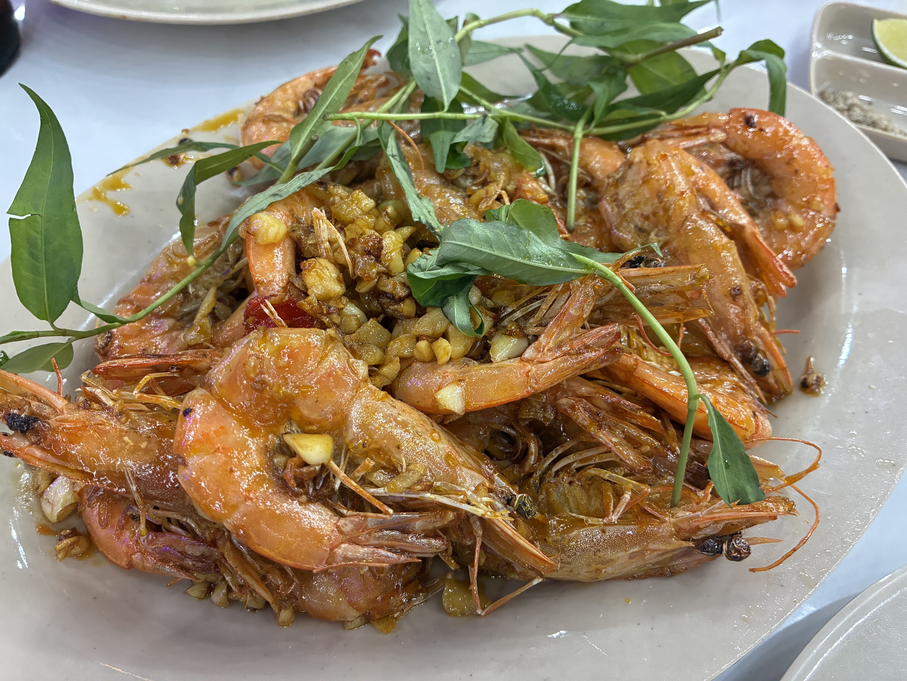
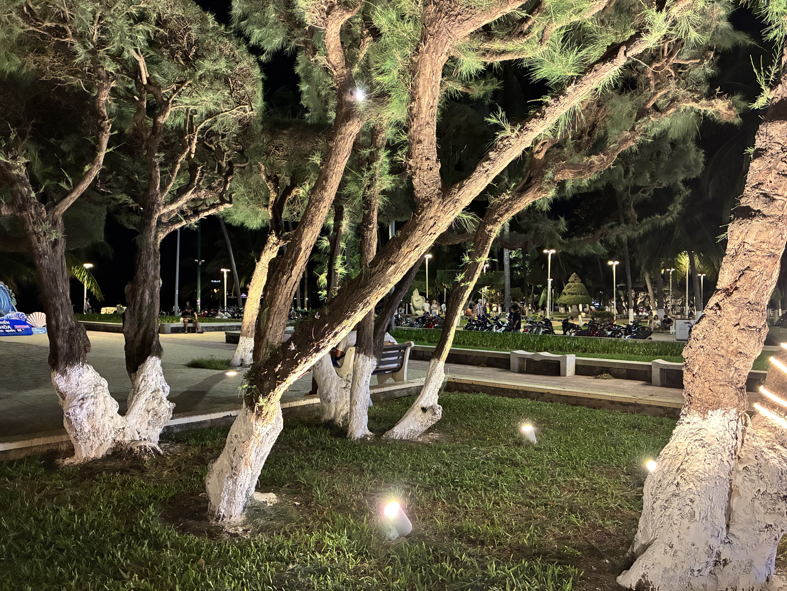

Last night we turned right instead of left outside the alleyway and found another seafood restaurant, where we had one of the best dinners of the trip. Every Vietnamese dish we ordered was exactly as we'd hoped, and some were even better.

Ironically, some of the best pizza I've had was here in Vietnam, at [Pizza 4P's](https://pizza4ps.com/). Today we ordered half-and-half: Japanese scallops with sweet miso gratin, and a four-mushroom pizza. So good that I also got myself an organic detox drink made with arugula, apples, and pineapple.

I can get full from eating fresh fruit all day here. I got another [mãng cầu xiêm](https://www.google.com/search?q=mang+cau+xiem) smoothie, and Thomas got some fresh-cut jackfruit and pineapple. When I say I miss Vietnamese food, it's really that I miss all the varieties of herbs and fruits. I can make a Vietnamese dish in the States, but without the right herbs to accompany it, it's just not the same.

I love everything coconut, and coconut ice cream is the best. One scoop is 35,000 VND ($1.34), the perfect amount to cleanse and refresh your palate. In the States, if you ask for one scoop of ice cream in a waffle cone, it's really three giant scoops, because they don't count the two that went inside the cone — the "single" scoop is just the part sitting on top. We suck at portion control.

We walked across the street to the beach side and sat down to hear some locals take to the mic. My goodness, they sound great! The man in black apparently owns the mic and speaker — he just takes donations without even having a sign up to say so. I saw one singer put some cash into the bag hanging from the mic, so we did the same after enjoying some great live music. What a nice idea.

<video controls src="../images/2026-08-20/IMG_2168.MOV"></video>