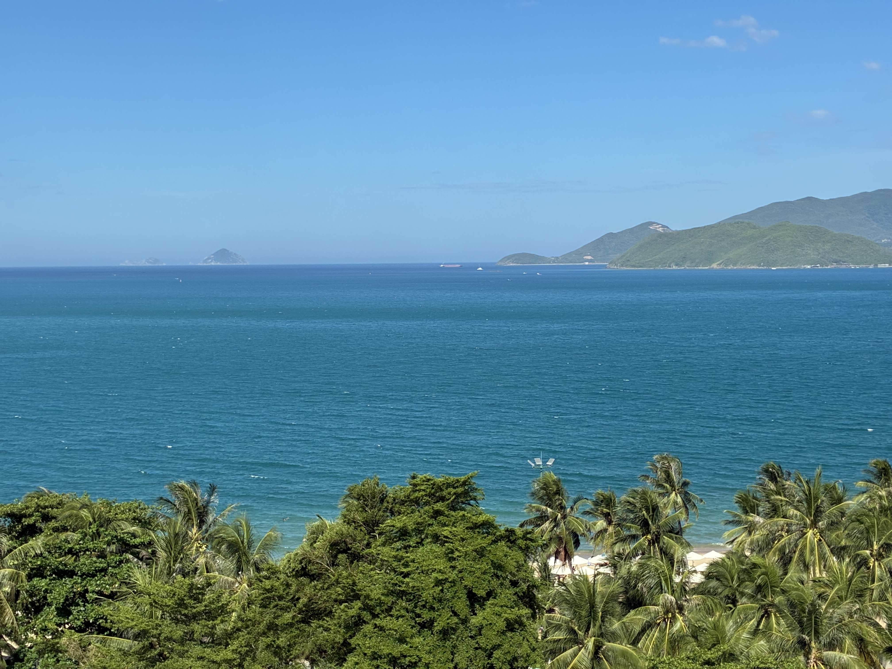
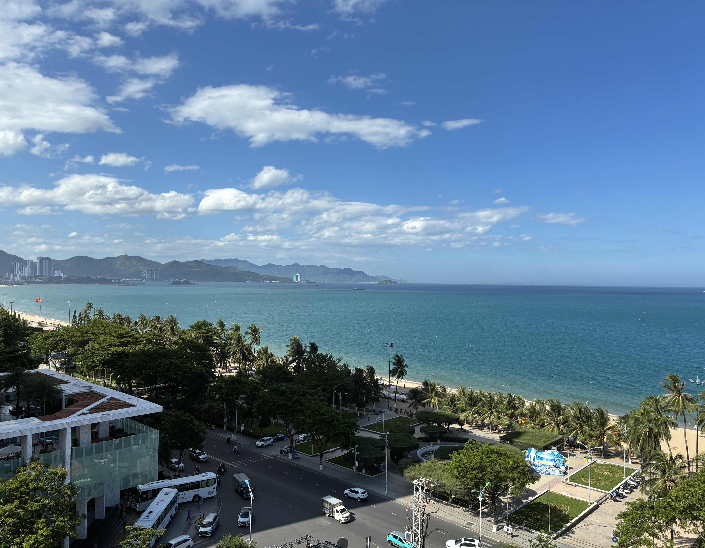
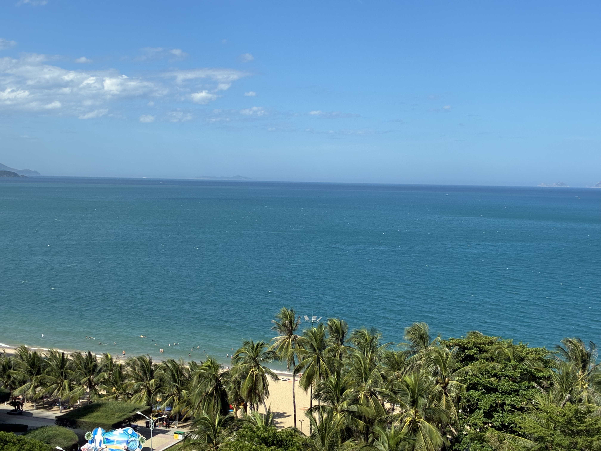
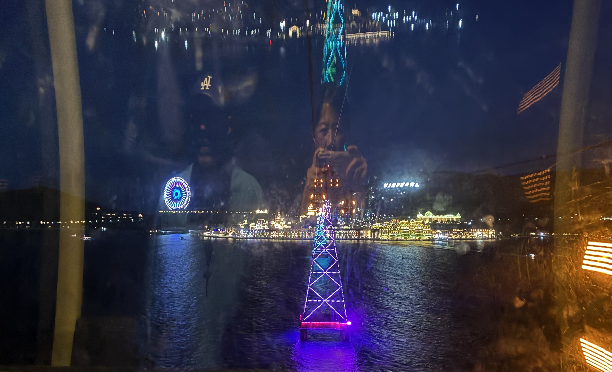
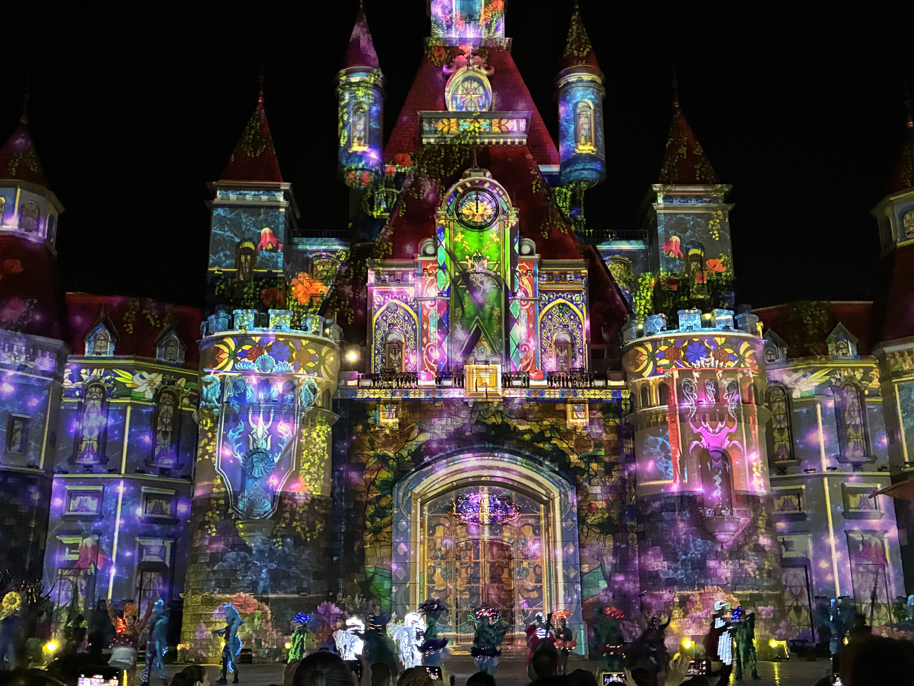

Killer view from top of our cheap hotel. There's a small pool up here, but it's midday now, so hot as hell.

Thomas got us tickets to [VinWonders Nha Trang](https://booking.vinwonders.com). It's an amusement park — think Disneyland without the rides but with lots of food options. Because it's on an island, the best part was taking the cable car over. Engineering like this blows my mind, and this was 20 years ago. 

Of course nothing beats the [Fansipan Legend cable car](https://sunworld.vn/en/fansipan) that we went on two years ago. It takes you up to the summit of Mount Fansipan — the highest peak in Indochina! This is also where you can be completely awestruck by the highest bronze Amitabha Buddha statue in Asia. Man-made wonders like this can only be explained by divine intervention, like God seriously had a hand in this. But the fact that this marvel rises from a once third-world country like Vietnam makes me weep. I see the men and women of this country do construction in flip flops and even barefoot. Being there and bearing witness is not just breathtaking, it's soul lifting and makes all my daily worries stupid.

