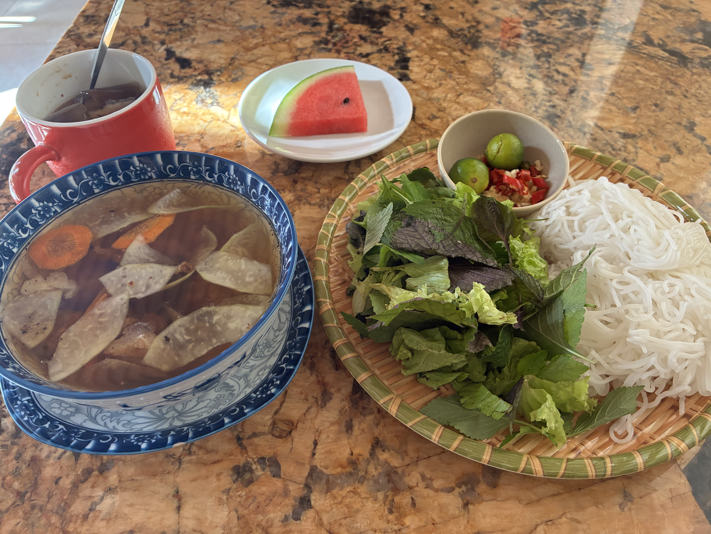
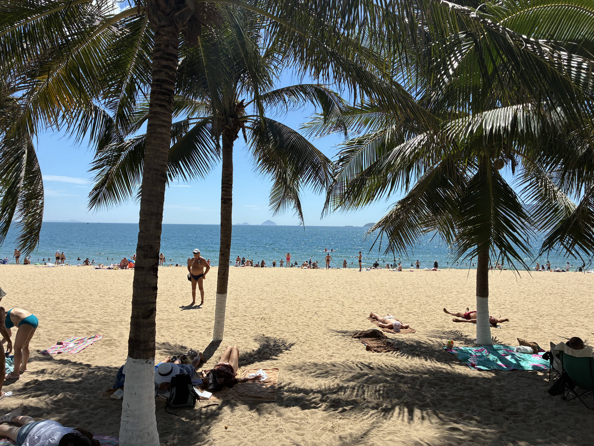
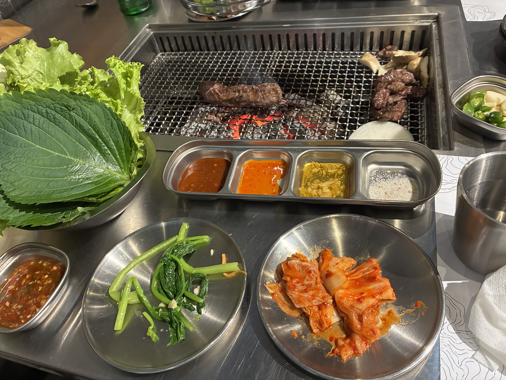
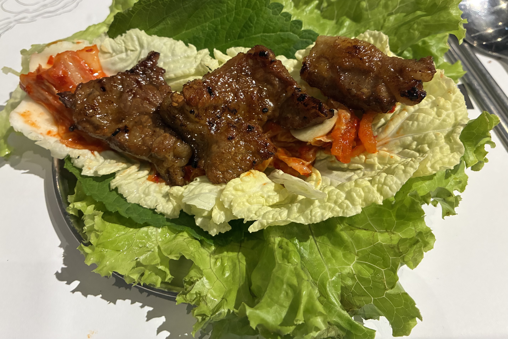

I'm having bún chả this morning for breakfast at the hotel. Hanoi is most famous for it, and it really is top-notch there. I can actually live in this hotel long term, like 3 months, because it's so affordable and close to everything. I'd buy a new bed, give it fresh paint, get a brighter lightbulb in the bathroom, add a ton of plants, buy a big dining table that doubles as a work surface. Oh, the shower floor tiles need to be redone so they slope better for water to drain. That's about it. When we first arrived, the front desk said they could do our laundry for 40,000 VND per kilogram. And they did a wonderful job, everything neatly folded and separately. But directly across the street is a laundromat that does it for half the price. I mean it was already very reasonable, but it's kinda weird to not take advantage of something that literally is right in front of us too.

The beach was perfect today. Spent two hours, a little bit crowded as it's Saturday. Yes, I want this every day. Not so much for me because I can't swim, but for Thomas. I teared up watching him swim because it's the only time he feels no pain - when he's in the water. He's a strong swimmer, loves to dive too. When we were at [Amiana](https://amianaresortsandhotels.com/amianaresortnhatrang/) two years ago, he spent a lot of time snorkeling and diving because the resort had a private lagoon beach.

We found this wonderful Korean BBQ for lunch. They use real charcoals and have a great fan system, the place is not smoky at all.

