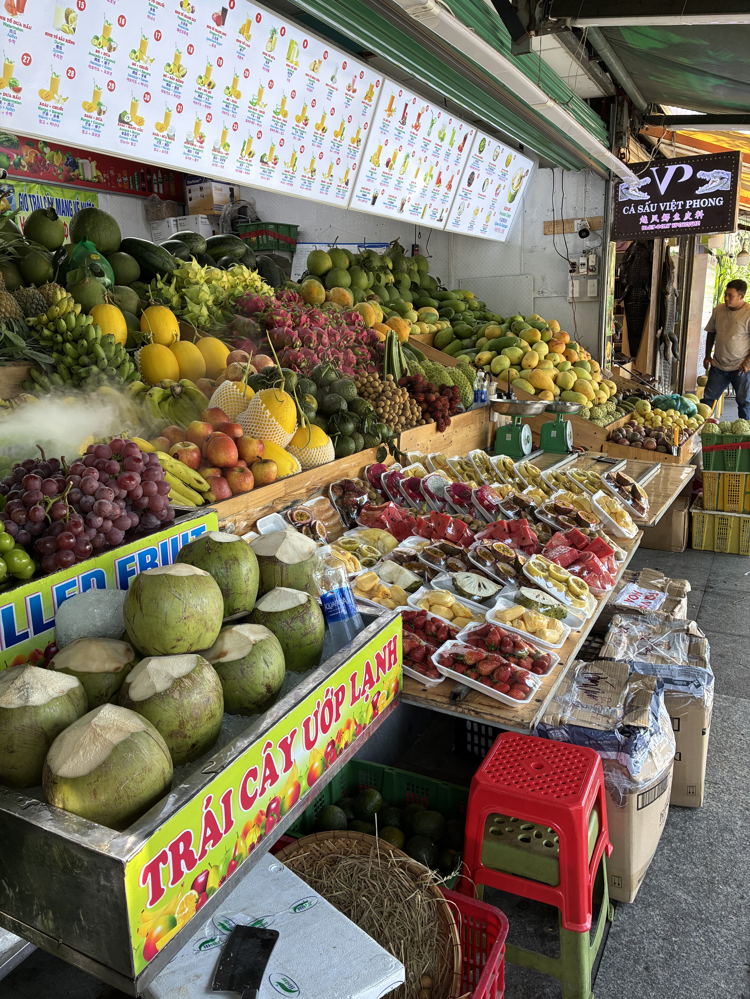

I'd only ever seen the streets erupt with celebration on social media — to be here for it in person is something else entirely. Vietnam had just beaten Thailand 2-0 in the first leg of the ASEAN Championship final, and the whole town lost its mind. We sat on the beach until past midnight to soak it all in. Everyone was cheering and honking, and it went on full blast until at least 3:00 AM.

<video controls src="../images/2026-08-22/IMG_2209.mov"></video>

There was one bad thing I saw at the beach last night. There are a lot of tourists here, and I watched them leave their trash behind — plastic cups, bottles and cans, food containers, bags, cigarette butts. I have zero tolerance for people who do this. You're a scumbag, full stop. I have never in my entire life just tossed a gum wrapper or any piece of trash anywhere. This is such a beautiful beach for all of us to enjoy, and when you're too selfish and lazy and disrespectful to carry out your own trash, you're a douchebag. They need to start handing out heavy fines.

I'm not exaggerating when I say there's a fruit stall (they make smoothies and juices too) like this on every other block. A fruit tray here runs 30,000 VND, the same price as a tall smoothie, which is $1.15.

