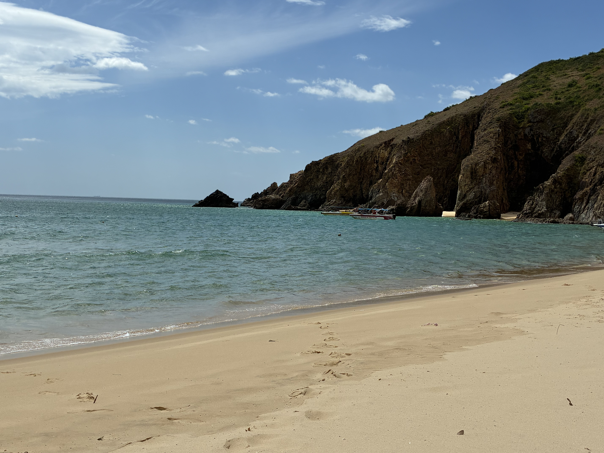
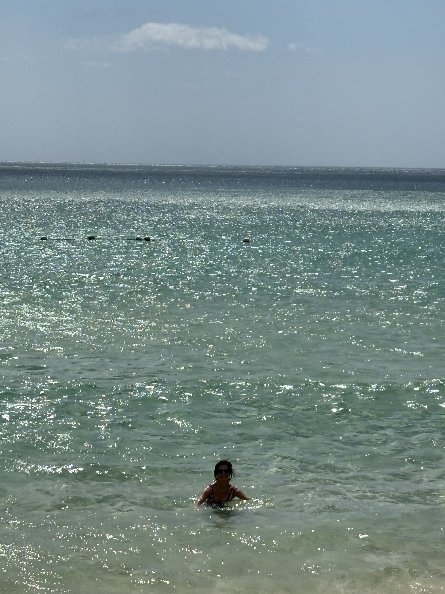
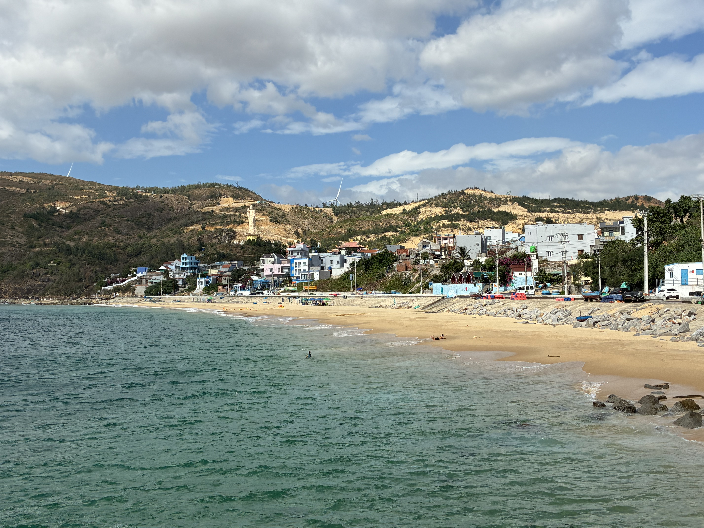
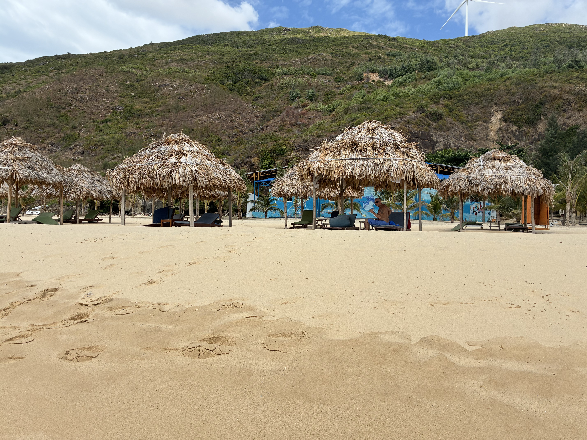
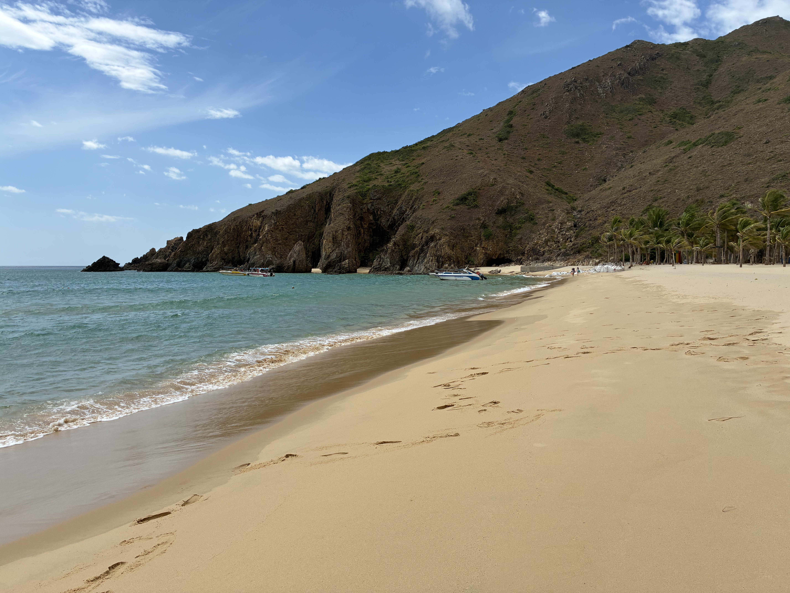
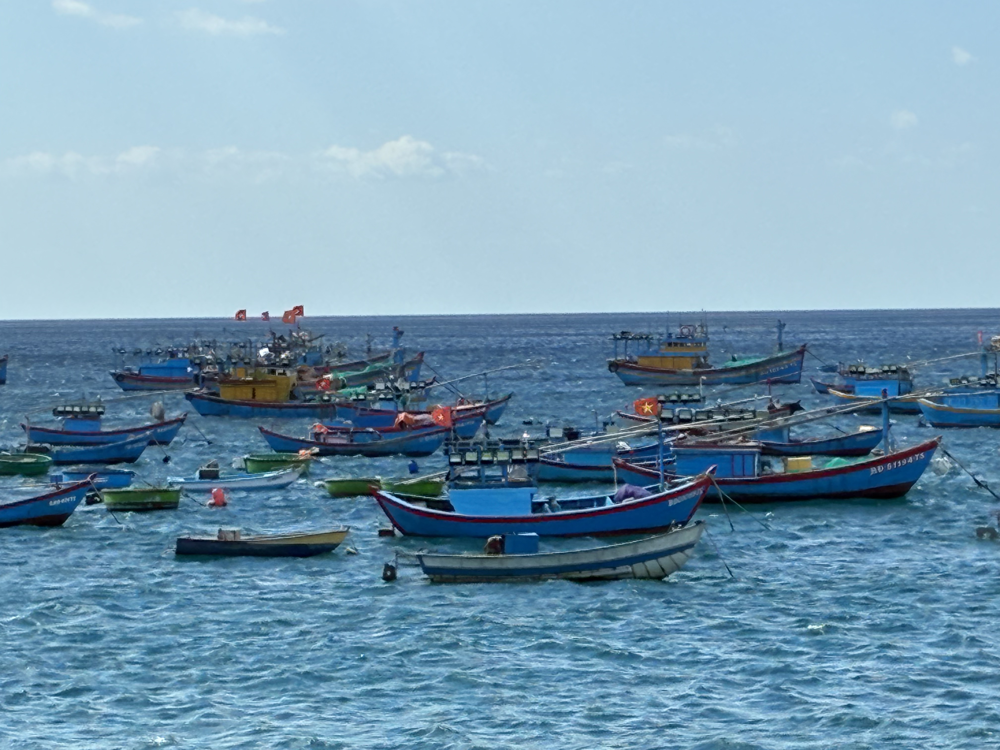
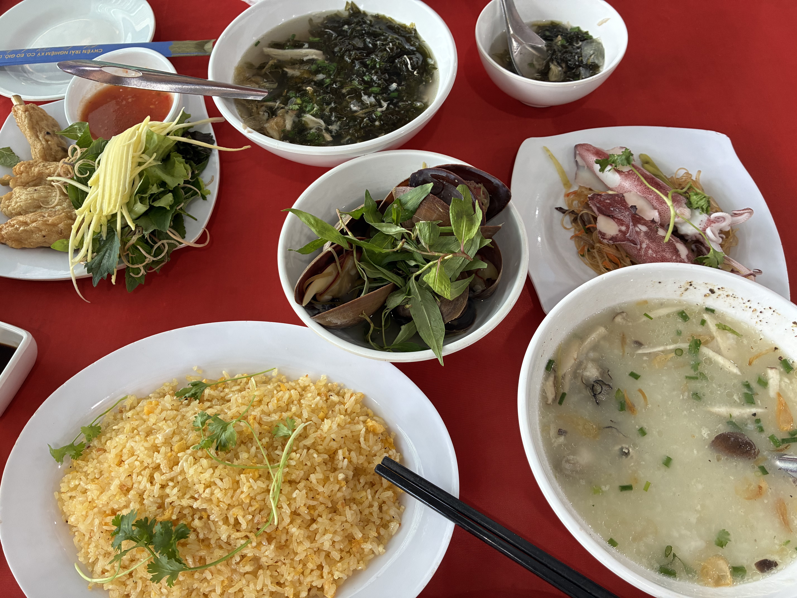

A driver picked us up at 8:00 AM and drove about 15 miles, crossing the Thi Mai Bridge, to the Phuong Mai Peninsula in Nhơn Lý, northeast of the city. We then took a short boat ride to Kỳ Co Beach.

Outside of the three days that I gave birth to my kids, today ranks as one of the happiest days. I spent nearly two hours just being in the water. The sand, the water, the waves — all worked together to melt my stress away. I'm grateful to be alive and be here.

We then had lunch, quite a feast of seafood extravaganza. Giant steamed clams and squid. All sorts of seafood went into the hotpot, along with okra, corn, mushrooms, and dark leafy greens. I ate so much, but I didn't feel heavy and bloated because everything was fresh.

