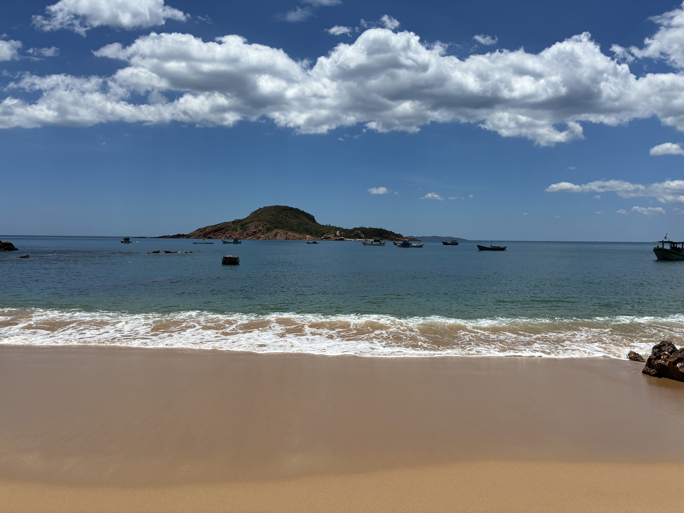
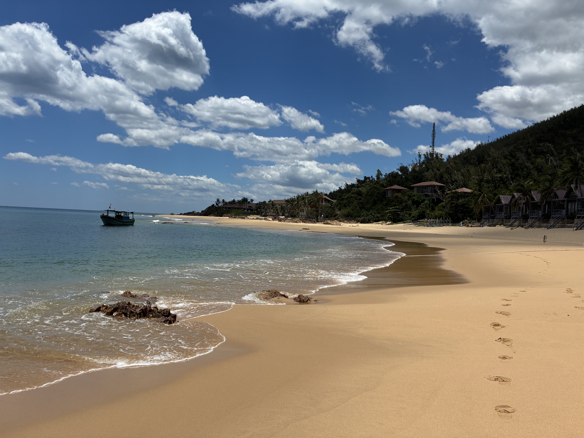

We wanted to find another beach today, so Thomas got a recommendation from the internet and called for a Grab car. But when the driver asked why we were going to this particular beach and we said "swimming," he disagreed — he said it's rocky there, not really meant for swimming.

So I asked where he'd recommend instead, adding that we'd already done Ky Co and taken the boat. Was there a beach where you could just get dropped off and start swimming? He suggested [Bãi Xép beach](https://www.google.com/maps/place/B%C3%A3i+X%C3%A9p+-+Quy+Nh%C6%A1n/@13.6846256,109.231308,3a,75y,90t/data=!3m8!1e2!3m6!1sCIABIhANX5TpdEFJ8VpanOGhF-KJ!2e10!3e12!6shttps:%2F%2Flh3.googleusercontent.com%2Fgps-cs-s%2FAHRPTWm8QJ_0fS1NCwEKlWupnNWAcEKwy7grR77UoaNiBWkxLi4plmge8fv8f8STn2Qa_iWt2F01ebF5DQ-VyVue2m1H-4k6cZ3SLyWm0U0_xW-gpZeWS66zBkHK38w_bAijJ_5rDa1AVqu7oU4i%3Dw86-h186-k-no!7i1848!8i4000!4m23!1m15!4m14!1m6!1m2!1s0x316f6dfcbebd0b83:0x87331816c1ec71d9!2zS2jDoWNoIHPhuqFuIFNhbGEgUXV5IE5oxqFuLCAxMjYvMjcgSGFpIELDoCBUcsawbmcsIFAsIFF1eSBOaMahbiwgR2lhIExhaSwgVmlldG5hbQ!2m2!1d109.2294966!2d13.7724285!1m6!1m2!1s0x316f72861b677905:0x9ee3fcfc76f514c8!2zQ2FzYSBNYXJpbmEgUmVzb3J0LCBRdeG7kWMgbOG7mSAxRCwgS2h1IFBo4buRIDEsIELDo2kgWMOpcCwgUGjGsOG7nW5nIEdo4buBbmggUsOhbmcsLCBRdXkgTmjGoW4gTmFtLCBHaWEgTGFpLCBWaWV0bmFt!2m2!1d109.2301316!2d13.6848891!3m6!1s0x316f73ea5a2c7a81:0x42891c9fd74b613d!8m2!3d13.6846256!4d109.231308!10e5!16s%2Fg%2F11fn98h59f?entry=ttu&g_ep=EgoyMDI2MDgyNC4wIKXMDSoASAFQAw%3D%3D), which is public — same southerly direction from the hotel, just a little farther, about 15 km total (9.3 miles).

See, we would never have found this pristine, quiet beach on our own. I loved that he wanted to know why we were going where we were going — in the States, we might've said it's none of your business. He also said he couldn't drive us right up to the beach, but it was a short walk, 500 meters. I mentioned my concern about how much walking Thomas could handle, and he said, "Don't worry, I'll find someone there with a scooter" — meaning everyone — "to take him." Turns out it was more like three blocks. What a gem this place is!

There are several resorts nearby, but none of them stick out like sore thumbs. One is [Casa Marina](https://casaresort.com.vn/), and I made a mental note to hopefully book one of the oceanfront bungalows — the ones you see in the picture below — on our next visit.

