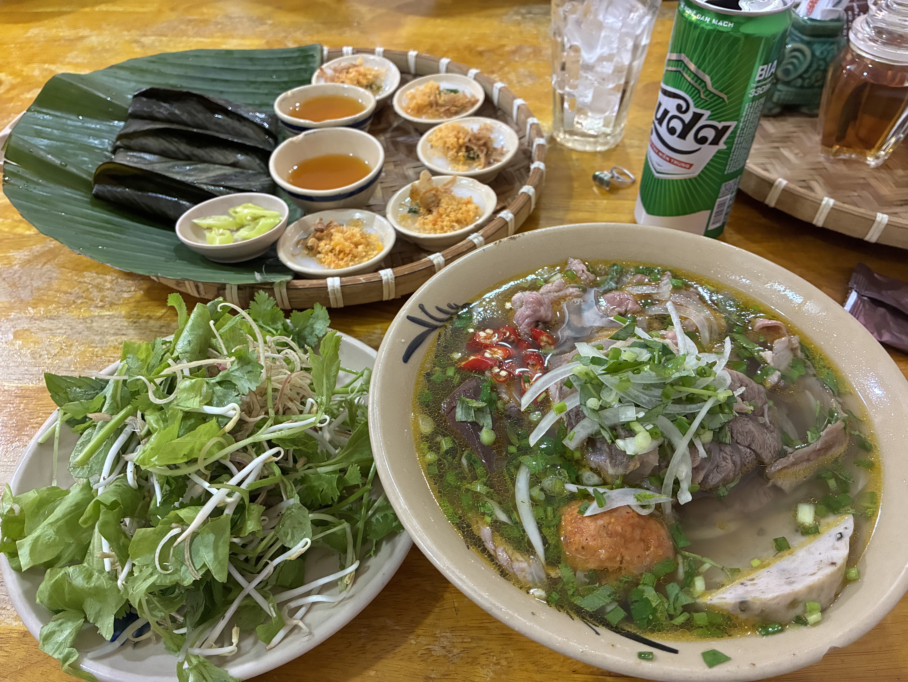
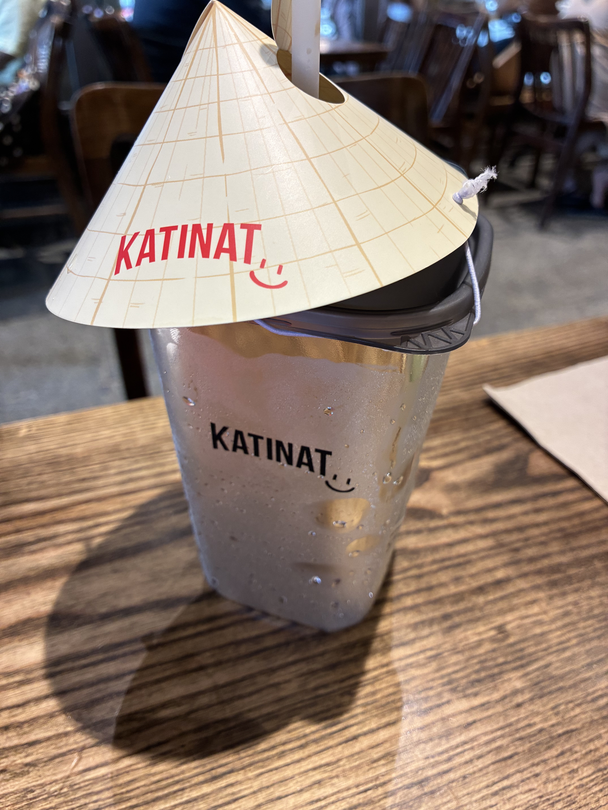
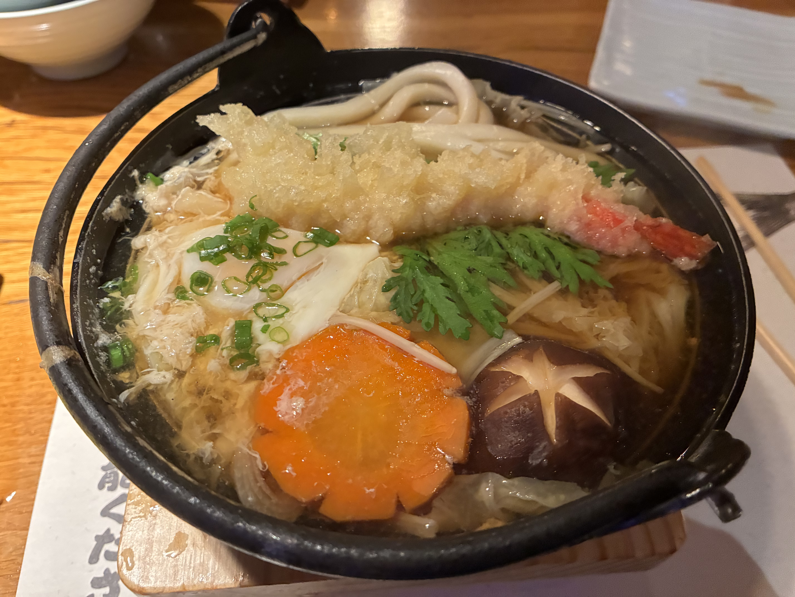

We flew back to Ho Chi Minh City and are staying at [Kin Hotel](https://kinhotel.com/en/kin/kin-hotel-thi-sach-edition) for two nights before we fly home.

I asked the doorman where he'd recommend to eat. He said it depends on what it is that I want to eat. Well, duh. I told him whatever is good to eat. I gestured toward Thomas, who was busy trying to secure a hotel umbrella as it started to rain, and let him know that what I want to eat normally starts with asking Thomas what he wants to eat. This conversation was going nowhere, and he had clearly judged that I'm just a dumb tourist who doesn't even know what she wants to eat in the first place. He said across the street, at the end of the block, is [Minh Món Huế](https://www.tripadvisor.com/Restaurant_Review-g293925-d33968146-Reviews-Minh_Mon_Hu_Hue_Rustic_Flavors_Restaurant-Ho_Chi_Minh_City.html), and the other way is a seafood restaurant. (Huế is a city on Vietnam's central coast and the former imperial capital, roughly halfway between Hanoi and Saigon.) Well, we just came from seafood haven in Quy Nhơn, so Huế food it is.

Wow. I had the best bún bò Huế (spicy beef noodle soup — the Emperor of Vietnam allegedly prefers this over phở). And my two favorite appetizers also come from here: bánh bèo and bánh bột lọc. These are more difficult to make and time consuming. Perfection!

[Katinat](https://katinat.vn/) is a chain coffee and tea shop here — another Starbucks-like place, even though they have actual Starbucks everywhere here too. I only want coconut coffee while in Vietnam, and after scanning the menu, I didn't see it. I asked the young man behind the counter if they had any, and he pointed to the menu. So I said, in English, because I now speak this once-foreign language fluently, "If I saw it on the menu, then I wouldn't be asking..." You little shit. What I got tasted like coffee with coconut syrup, but it came in a nice branded cup with a little paper cone perched on top — the cone is not the extra paper trash we need on this planet.

I told the doorman that we wanted sushi for dinner. He told me more than I cared to know or understand, including that this place has "a lot of girls," while looking and smiling sheepishly at Thomas. I know I said sushi and not a whorehouse. He then told me to wait, as he wanted to ask someone else a question about where we should go. He came back to suggest a place I had in mind all along, apologizing and adding that he didn't want me to end up somewhere expensive. Only then did I realize he thought I meant an omakase. I said no omakase, just sushi.

A block from our hotel is [Sushi Hokkaido Sachi](https://sushihokkaidosachi.com.vn/), familiar by name, as there are 11 of them in HCMC alone and 4 more in Hanoi. This time I wanted some nabeyaki udon, my favorite, and it did not disappoint.

